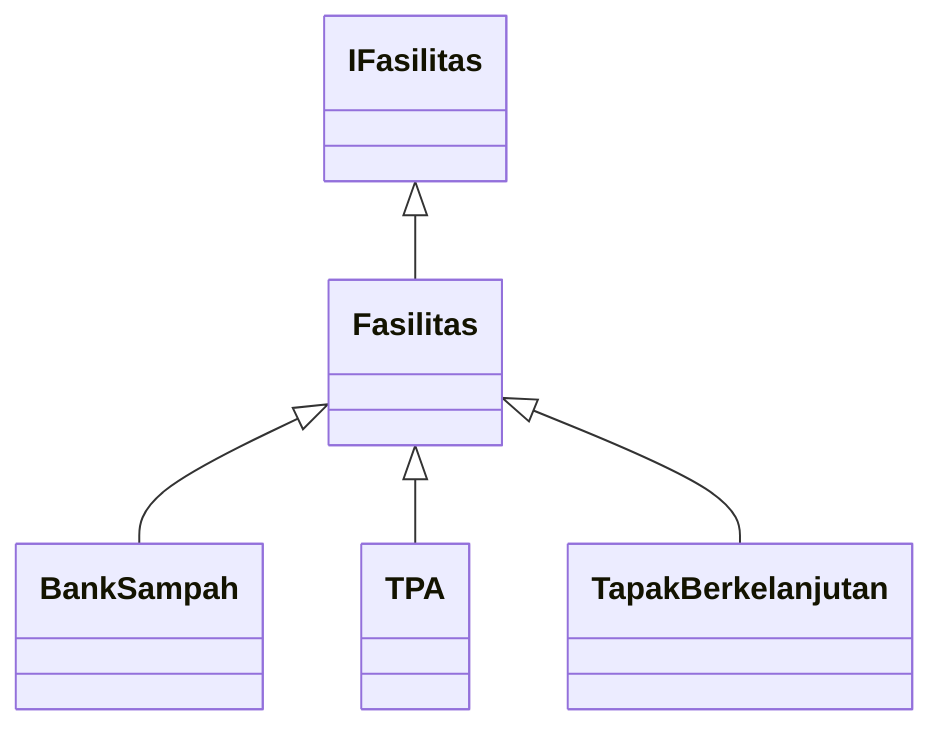

# Bumi Nusantara Project
## 🌱 Sistem Monitoring dan Pengelolaan Fasilitas Hijau

## SDGs: Sustainable Cities and Communities  
## **Fokus Area:** Smart and Environmentally Friendly Urban Planning  


---

### Anggota Kelompok:
1. Adella Putri (2409116006)
2. Jen Agresia Misti (2409116007)
3. Fikri Abiyyu Rahman (2409116063)
4. Dafa Firdaus (2409116093)
5. Jabbar Hafizh Abdillah (2409116116)

## Deskripsi Singkat Program

Aplikasi **“Sistem Monitoring dan Pengelolaan Fasilitas Hijau”** merupakan program berbasis **Java** yang dikembangkan dengan menerapkan **lima pilar utama Pemrograman Berorientasi Objek (Object-Oriented Programming / OOP)**, yaitu **Encapsulation**, **Inheritance**, **Abstraction**, **Polymorphism**, dan **Interface**.  
Program ini juga terintegrasi dengan **basis data MySQL** melalui **XAMPP**, serta dilengkapi dengan **Graphical User Interface (GUI)** yang dibangun menggunakan **Java Swing** pada **NetBeans IDE**.

Proyek ini dirancang untuk mendukung pencapaian **Tujuan Pembangunan Berkelanjutan (SDGs) ke-11**, yakni *Sustainable Cities and Communities*, dengan fokus pada *Smart and Environmentally Friendly Urban Planning*.  
Melalui sistem ini, pengelolaan berbagai fasilitas hijau seperti **taman kota**, **bank sampah**, dan **Tempat Pembuangan Akhir (TPA)** dapat dilakukan secara lebih efektif, transparan, dan terintegrasi.

Aplikasi ini menyediakan fitur utama berupa **pendataan, pemantauan, dan pelaporan fasilitas hijau**, yang dapat diakses oleh pihak pemerintah maupun masyarakat.  
Seluruh data disimpan dan dikelola secara terpusat melalui basis data, sehingga proses **monitoring dan evaluasi kondisi lingkungan** dapat dilakukan secara efisien serta mendukung pembuatan kebijakan berbasis data (*data-driven policy*).

---


<details>
<summary>FLOWCHART PROGRAM</summary>


</details>

<details>
<summary>USE CASE DIAGRAM</summary>
    


</details>

---

# 🧩 Analisis Penerapan 5 Pilar OOP pada Package `Model`
Proyek **Sistem Monitoring dan Pengelolaan Fasilitas Hijau** dikembangkan menggunakan bahasa pemrograman **Java** dengan paradigma **Object-Oriented Programming (OOP)**.  
Seluruh file dalam package `Model` telah menerapkan kelima pilar utama OOP, yaitu:

> **Encapsulation**, **Inheritance**, **Abstraction**, **Polymorphism**, dan **Interface**.

Berikut penjelasan lengkap disertai potongan kode dan analisis penerapan dari setiap pilar OOP:

---

## 1. Encapsulation (Enkapsulasi)

### Konsep:
Enkapsulasi adalah prinsip OOP untuk melindungi data agar tidak dapat diakses langsung dari luar kelas. <br> Data disembunyikan menggunakan modifier `private` dan hanya bisa diakses melalui method **getter** dan **setter**.

---

### 📁 a. `Fasilitas.java` (Package: `Model`)
```java
private int id_fasilitas;
private String nama_fasilitas;
private String jenis_fasilitas;
private String lokasi;
private String id_kelurahan;
private double latitude;
private double longitude;

public int getId_fasilitas() { return id_fasilitas; }
public void setId_fasilitas(int id_fasilitas) { this.id_fasilitas = id_fasilitas; }

public String getNama_fasilitas() { return nama_fasilitas; }
public void setNama_fasilitas(String nama_fasilitas) { this.nama_fasilitas = nama_fasilitas; }
```

Kode ini terdapat pada package `Model`, file `Fasilitas.java`.<br>
Atribut `id_fasilitas`, `nama_fasilitas`, dll dijadikan private agar tidak bisa diakses langsung. <br> Akses dan modifikasi dilakukan hanya lewat getter–setter untuk menjaga integritas data.


### 📁 b. `Kelurahan.java`
```java
private String id_kelurahan;
private String nama_kelurahan;
private String lokasi_kelurahan;
private String zona;
private double latitude;
private double longitude;

public String getNama_kelurahan() { return nama_kelurahan; }
public void setNama_kelurahan(String nama_kelurahan) { this.nama_kelurahan = nama_kelurahan; }
```

Atribut seperti `id_kelurahan`, `zona`, dan `lokasi_kelurahan` dilindungi dari akses langsung.<br>
Hal ini memastikan data administratif setiap kelurahan tetap aman dan terkontrol.

### 📁 c. `Laporan.java` 
```java
private int id_laporan;
private int id_user;
private String id_kelurahan;
private String alamat_lokasi;
private byte[] foto;
private String deksripsi;
private String status;
private Timestamp tanggal_lapor;
```

Atribut pada kelas Laporan dibuat private agar data sensitif tidak bisa diakses langsung dari luar.<br>
Selain itu, method `setStatus()` juga menerapkan validasi internal agar nilai status laporan hanya dapat berupa:<br>
Menunggu, Diproses, atau Selesai.

### 📁 d. `User.java`
```java
private int id_user;
private String email;
private String password;
private String role;

public String getEmail() { return email; }
public void setEmail(String email) { this.email = email; }

public String getPassword() { return password; }
public void setPassword(String password) { this.password = password; }
```

`User.java` menggunakan `enkapsulasi` untuk melindungi informasi penting seperti email dan password.<br>
Akses langsung ke atribut dicegah demi keamanan akun pengguna.<br>
Proses validasi data juga dilakukan melalui method validate(),<br>
agar email dan password wajib diisi dengan benar.


### 📁 e. `BankSampah.java`, `TPA.java`, dan `TapakBerkelanjutan.java`
Ketiga kelas turunan Fasilitas ini juga menerapkan enkapsulasi pada atribut-atribut khususnya, seperti:
```java

private String nama_pengelola;
private String kontak;
private String jam_operasional;
private String status;
private double kapasitas_maks_ton;
private double luas_lahan;
private String kondisi;
```

Semua atribut ini dijaga menggunakan akses private dan hanya dapat dimodifikasi melalui konstruktor<br> 
atau setter bawaan dari kelas induk. Hal ini menjaga agar data setiap fasilitas spesifik tetap aman<br> 
dari perubahan yang tidak sah.

---

🔎 Penerapan `enkapsulasi` pada seluruh kelas di package Model menunjukkan pengelolaan data yang aman dan terstruktur.
Dengan menjadikan atribut sebagai private serta menyediakan akses terkontrol melalui getter–setter dan validasi, sistem memastikan setiap entitas seperti Fasilitas, Laporan, dan User hanya dapat dimanipulasi melalui jalur resmi yang sudah ditentukan — mendukung keamanan dan keandalan data.

---

### 2. Inheritance (Pewarisan)

### Konsep:
Mewarisi atribut dan method dari kelas induk agar bisa digunakan ulang oleh kelas turunan.

---

### 📁 a. `BankSampah.java`
```java
public class BankSampah extends Fasilitas {
    private String nama_pengelola;
    private String kontak;
    private String jam_operasional;

    public BankSampah(int id_fasilitas, String nama_fasilitas, String jenis_fasilitas,
                      String lokasi, String id_kelurahan, double latitude, double longitude,
                      String nama_pengelola, String kontak, String jam_operasional) {
        super(id_fasilitas, nama_fasilitas, jenis_fasilitas, lokasi, id_kelurahan, latitude, longitude);
        this.nama_pengelola = nama_pengelola;
        this.kontak = kontak;
        this.jam_operasional = jam_operasional;
    }
}
```

Kelas `BankSampah` mewarisi semua atribut dan perilaku dari kelas induk `Fasilitas`,seperti `nama_fasilitas`, `lokasi`, `jenis_fasilitas`, serta `koordinat latitude dan longitude`.<br> 
Dengan menggunakan keyword `extends`, kelas ini dapat langsung menggunakan semua method dari `Fasilitas,` tanpa harus menuliskannya ulang.

Selain itu, method super() di dalam konstruktor digunakan untuk memanggil konstruktor dari kelas induk, yang membantu menginisialisasi atribut dasar dari objek Fasilitas.

### 📁 b. `TPA.java`
```java
public class TPA extends Fasilitas {
    private String status;
    private double kapasitas_maks_ton;

    public TPA(int id_fasilitas, String nama_fasilitas, String jenis_fasilitas,
               String lokasi, String id_kelurahan, double latitude, double longitude,
               String status, double kapasitas_maks_ton) {
        super(id_fasilitas, nama_fasilitas, jenis_fasilitas, lokasi, id_kelurahan, latitude, longitude);
        this.status = status;
        this.kapasitas_maks_ton = kapasitas_maks_ton;
    }
}
```

Kelas `TPA` (Tempat Pembuangan Akhir) juga menurunkan sifat dari `Fasilitas`.<br> 
Dengan pewarisan, `TPA` otomatis memiliki semua atribut dan fungsi umum dari kelas induknya seperti lokasi dan koordinat.<br> 
Atribut `tambahan status` dan `kapasitas_maks_ton` kemudian memperluas perilaku TPA agar sesuai dengan konteksnya sebagai fasilitas pengelolaan sampah.

### 📁 c. `TapakBerkelanjutan.java`
```java
public class TapakBerkelanjutan extends Fasilitas {
    private double luas_lahan;
    private String kondisi;

    public TapakBerkelanjutan(int id_fasilitas, String nama_fasilitas, String jenis_fasilitas,
                              String lokasi, String id_kelurahan, double latitude, double longitude,
                              double luas_lahan, String kondisi) {
        super(id_fasilitas, nama_fasilitas, jenis_fasilitas, lokasi, id_kelurahan, latitude, longitude);
        this.luas_lahan = luas_lahan;
        this.kondisi = kondisi;
    }
}
```

Kelas `TapakBerkelanjutan` juga merupakan turunan dari `Fasilitas`.<br> 
Dengan mewarisi atribut umum seperti `nama_fasilitas`, `jenis_fasilitas`, dan `lokasi`, kelas ini hanya perlu menambahkan<br> 
atribut baru `(luas_lahan dan kondisi)` yang spesifik untuk jenis fasilitas hijau berkelanjutan.

Pewarisan ini memudahkan proses pengembangan, karena setiap jenis fasilitas hanya perlu menambahkan detail uniknya masing-masing.

### 📁 d. `Struktur Hierarki Pewarisan`
Struktur pewarisan pada package Model dapat digambarkan sebagai berikut:


Kelas Fasilitas bertindak sebagai kelas induk yang berisi atribut umum dari seluruh jenis fasilitas, sedangkan<br> 
kelas BankSampah, TPA, dan TapakBerkelanjutan adalah kelas turunan yang memperluas fungsionalitasnya.

---

🔎 Penerapan pewarisan `(inheritance)` dalam package Model memperlihatkan desain yang rapi dan efisien.
Kelas Fasilitas menjadi fondasi utama bagi seluruh jenis fasilitas, sementara kelas-kelas turunannya (BankSampah, TPA, dan TapakBerkelanjutan) menambahkan atribut unik masing-masing.
Dengan begitu, sistem menjadi lebih modular, konsisten, dan mudah diperluas untuk jenis fasilitas hijau lain di masa mendatang.

---

### 3. Abstraction (Abstraksi)

### Konsep:
Abstraksi digunakan untuk menyembunyikan detail kompleks, hanya menampilkan bagian penting kepada pengguna melalui kelas abstrak atau method abstrak.

---

### 📁 a. `Fasilitas.java`
```java
public void tampilkanInfo() {
    System.out.println("Fasilitas: " + nama_fasilitas + 
        " | Jenis: " + jenis_fasilitas + 
        " | Lokasi: " + lokasi + 
        " (" + latitude + ", " + longitude + ")");
}
```
Method `tampilkanInfo()` pada kelas Fasilitas berfungsi sebagai bentuk abstraksi fungsional,<br> 
karena ia hanya menampilkan informasi utama fasilitas tanpa memperlihatkan bagaimana data tersebut disimpan atau diolah di dalam objek.

Dengan cara ini, pengguna cukup tahu “apa” yang dilakukan method `(menampilkan informasi fasilitas)`,<br> 
tanpa perlu tahu “bagaimana” cara internalnya bekerja.

### 📁 b. `Laporan.java`
Kelas Laporan memiliki banyak atribut seperti foto, deksripsi, dan status, namun tidak semuanya ditampilkan ke publik.
Dalam implementasinya, sistem dapat menampilkan laporan secara ringkas menggunakan format tertentu, seperti:
```java
System.out.println("Laporan #" + id_laporan +
                   " | Kelurahan: " + nama_kelurahan +
                   " | Status: " + status);

```
Dengan cara ini, abstraksi digunakan untuk menyembunyikan data internal laporan seperti `ID pengguna`, `byte array foto`, dan `timestamp`,
sehingga hanya informasi penting yang relevan untuk pengguna yang tampil di antarmuka.

### 📁 c. `Kelurahan.java`
```java
public void tampilkanInfo() {
    System.out.println("Kelurahan: " + nama_kelurahan +
            " | Lokasi: " + lokasi_kelurahan +
            " | Zona: " + zona);
}
```
Kelas Kelurahan juga menggunakan abstraksi untuk menyajikan data secara sederhana.<br> 
Hanya informasi penting seperti `nama kelurahan`, `lokasi`, dan `zona yang ditampilkan`,<br> 
tanpa membuka detail internal atribut seperti `koordinat` atau `validasi data`.<br> 

Abstraksi ini membuat program lebih mudah digunakan, karena pengguna cukup memanggil satu method<br> 
untuk mendapatkan gambaran umum tentang objek kelurahan.

### 📁 d. `User.java`
```java
public void tampilkanInfo() {
    System.out.println("User: " + email + " | Role: " + role);
}
```

Kelas User menerapkan abstraksi dengan hanya menampilkan informasi umum pengguna seperti `email` dan `peran` (role).<br> 
Detail sensitif seperti `password` disembunyikan agar aman dan tidak terekspos ke publik.<br> 
Hal ini juga merupakan bentuk abstraksi keamanan `(security abstraction)` yang umum dalam sistem berbasis pengguna.

### 📁 e. `IFasilitas.java`
```java
public interface IFasilitas {
    void tampilkanInfo();
}
```

Interface IFasilitas mendefinisikan method `tampilkanInfo()` tanpa memberikan implementasinya secara langsung.<br> 
Inilah bentuk abstraksi murni, di mana interface hanya mendeklarasikan apa yang harus dilakukan,<br> 
sementara bagaimana caranya diatur oleh masing-masing kelas yang mengimplementasikannya.

Hal ini membuat setiap jenis fasilitas `(TPA, BankSampah, TapakBerkelanjutan)` bebas mengatur cara menampilkan<br> 
informasinya sendiri, selama tetap mengikuti kontrak dari interface.

---

🔎 Penerapan `abstraksi` pada package Model membuat sistem lebih ringkas, aman, dan mudah dipahami.
Detail internal objek disembunyikan, sementara informasi penting tetap bisa diakses dengan mudah.
Dengan memanfaatkan method seperti tampilkanInfo() dan interface IFasilitas, sistem berhasil menerapkan abstraksi yang
memisahkan representasi data dari logika implementasinya, menjadikan program lebih modular dan mudah dikembangkan di masa depan.

---

### 4. Polymorphism (Polimorfisme)

### Konsep:
Polimorfisme memungkinkan method dengan nama yang sama memiliki perilaku berbeda tergantung pada objek yang memanggilnya.

---

### 📁 a. `Fasilitas.java`
```java
public void tampilkanInfo() {
    System.out.println("Fasilitas: " + nama_fasilitas + 
        " | Jenis: " + jenis_fasilitas + 
        " | Lokasi: " + lokasi + 
        " (" + latitude + ", " + longitude + ")");
}
```

Method `tampilkanInfo()` di kelas `Fasilitas` menampilkan informasi umum tentang semua fasilitas.<br> 
Namun, method ini akan dioverride (ditimpa) oleh setiap kelas turunan agar menampilkan data yang lebih spesifik.<br> 
Ini merupakan penerapan runtime polymorphism dalam sistem ini.

### 📁 b. `BankSampah.java`
```java
@Override
public void tampilkanInfo() {
    System.out.println("Bank Sampah: " + getNama_fasilitas() +
            " | Pengelola: " + nama_pengelola +
            " | Kontak: " + kontak);
}
```

Kelas BankSampah men-override method `tampilkanInfo()` milik `Fasilitas`.<br> 
Hasilnya, ketika objek BankSampah dipanggil melalui referensi tipe Fasilitas,<br> 
yang dijalankan tetap versi milik `BankSampah` sendiri, inilah contoh dynamic method dispatch (polimorfisme dinamis).

Perilaku ini memungkinkan setiap jenis fasilitas menampilkan informasi yang berbeda tanpa mengubah struktur dasarnya.

### 📁 c. `TPA.java`
```java
@Override
public void tampilkanInfo() {
    System.out.println("TPA: " + getNama_fasilitas() +
            " | Kapasitas: " + kapasitas_maks_ton + " ton" +
            " | Status: " + status);
}
```
Kelas `TPA` juga menerapkan method `overriding` terhadap `tampilkanInfo()`.<br> 
Bedanya, versi ini menampilkan kapasitas dan status operasi `TPA`,<br> 
yang tidak relevan untuk fasilitas lain seperti `BankSampah`.

Dengan begitu, meskipun nama method sama, output dan maknanya menyesuaikan konteks objek yang dipanggil.

### 📁 d. `TapakBerkelanjutan.java`
```java
@Override
public void tampilkanInfo() {
    System.out.println("Tapak Berkelanjutan: " + getNama_fasilitas());
    System.out.println("Luas Lahan: " + luas_lahan + " m² | Kondisi: " + kondisi);
}
```

Method `tampilkanInfo()` di kelas `TapakBerkelanjutan` menampilkan informasi yang lebih detail<br>
terkait luas lahan dan kondisi tapak.<br>
Perbedaan perilaku ini menunjukkan polimorfisme antar subclass,<br>
di mana setiap objek memiliki cara sendiri untuk menampilkan datanya.

### 📁 e. `Kelurahan.java`
```java
public boolean validate() {
    return id_kelurahan != null && !id_kelurahan.isEmpty()
        && nama_kelurahan != null && !nama_kelurahan.isEmpty()
        && lokasi_kelurahan != null && !lokasi_kelurahan.isEmpty()
        && zona != null && (zona.equals("hijau") || zona.equals("kuning") || zona.equals("merah"));
}
```

Kelas Kelurahan menggunakan method `validate()` sebagai bentuk polimorfisme fungsional.<br>
Meskipun tidak secara eksplisit mewarisi dari kelas lain, method ini memiliki konsep yang sama dengan validasi di kelas User,<br>
di mana masing-masing kelas memiliki cara sendiri untuk memverifikasi data internalnya.

### 📁 f. User.java
```java
public boolean validate() {
    return email != null && !email.isEmpty()
        && password != null && !password.isEmpty()
        && role != null && (role.equalsIgnoreCase("admin") || role.equalsIgnoreCase("user"));
}
```

Kelas User juga menerapkan method `validate()` tetapi dengan logika berbeda dari Kelurahan.<br>
Inilah bentuk polimorfisme antar kelas berbeda dengan nama method yang sama namun perilaku yang berbeda,<br>
menunjukkan fleksibilitas desain sistem berbasis objek.

---

🔎 Penerapan `abstraksi` pada package Model membuat sistem lebih ringkas, aman, dan mudah dipahami.
Penerapan polimorfisme pada package Model menjadikan sistem lebih fleksibel dan efisien.
Setiap jenis fasilitas dapat memiliki cara unik dalam menampilkan datanya, meskipun menggunakan nama method yang sama.
Selain itu, method validate() di beberapa kelas juga menunjukkan bahwa sistem ini mampu mengadaptasi perilaku berbeda sesuai konteks objek.

Dengan adanya polimorfisme, sistem mudah diperluas, mudah dirawat, dan tetap konsisten dalam struktur tanpa perlu menduplikasi kode yang sama di berbagai kelas.

---

### 5. Interface (Antarmuka)
### Konsep:
Interface mendefinisikan kontrak perilaku umum yang wajib diimplementasikan oleh kelas yang menggunakannya.

---

### 📁 a. `IFasilitas.java`
```java
public interface IFasilitas {
    void tampilkanInfo();
}
```

Interface IFasilitas berisi satu method abstrak, yaitu `tampilkanInfo()`.<br>
Method ini menjadi kontrak wajib bagi setiap kelas yang ingin diakui sebagai bagian dari sistem fasilitas.

Dengan cara ini, setiap kelas baik `Fasilitas`, `BankSampah`, `TPA`, maupun `TapakBerkelanjutan`,<br>
harus menyediakan implementasi dari method tersebut sesuai konteks masing-masing.

### 📁 b. Implementasi di Kelas `Fasilitas.java`
```java
public class Fasilitas implements IFasilitas {
    @Override
    public void tampilkanInfo() {
        System.out.println("Fasilitas: " + nama_fasilitas +
            " | Jenis: " + jenis_fasilitas +
            " | Lokasi: " + lokasi +
            " (" + latitude + ", " + longitude + ")");
    }
}
```

Dengan mengimplementasikan `IFasilitas`, kelas `Fasilitas` memastikan bahwa semua kelas turunannya<br>
`(TPA, BankSampah, TapakBerkelanjutan)` otomatis juga memiliki kontrak method yang sama,<br>
dan bisa menyesuaikan perilakunya lewat polimorfisme `(method overriding)`.

### 📁 c. Implementasi Tidak Langsung di Kelas Turunan
Berikut adalah contoh penerapan kontrak dari IFasilitas secara tidak langsung melalui inheritance:
```java
public class BankSampah extends Fasilitas {
    @Override
    public void tampilkanInfo() {
        System.out.println("Bank Sampah: " + getNama_fasilitas() +
                " | Pengelola: " + nama_pengelola +
                " | Kontak: " + kontak);
    }
}
```

```java
public class TPA extends Fasilitas {
    @Override
    public void tampilkanInfo() {
        System.out.println("TPA: " + getNama_fasilitas() +
                " | Kapasitas: " + kapasitas_maks_ton + " ton" +
                " | Status: " + status);
    }
}
```

```java
public class TapakBerkelanjutan extends Fasilitas {
    @Override
    public void tampilkanInfo() {
        System.out.println("Tapak Berkelanjutan: " + getNama_fasilitas());
        System.out.println("Luas Lahan: " + luas_lahan + " m² | Kondisi: " + kondisi);
    }
}
```

Setiap subclass memiliki implementasi sendiri terhadap method `tampilkanInfo()`.
Hal ini menunjukkan bagaimana `interface` berfungsi sebagai fondasi perilaku seragam,
sementara tiap kelas bebas menentukan isi dan logika spesifiknya.

---

🔎 Penerapan `interface` pada package `Model` menjamin bahwa setiap kelas fasilitas dalam sistem memiliki perilaku standar dan dapat saling berinteraksi dengan konsisten.
Dengan `IFasilitas` sebagai kontrak dasar, sistem menjadi lebih modular, fleksibel, dan mudah diperluas.

Interface ini memperkuat pondasi arsitektur sistem berbasis OOP dengan memastikan semua entitas memiliki identitas perilaku yang seragam namun fleksibel dalam implementasi.

---

### 🌍 Sustainability Reflection
Penerapan lima pilar OOP pada package Model membentuk sistem yang terstruktur, efisien, dan mudah dikembangkan.<br>
Melalui enkapsulasi, data penting terlindungi; pewarisan meminimalkan duplikasi kode;<br>
abstraksi menyederhanakan kompleksitas; polimorfisme memberi fleksibilitas perilaku;<br>
dan interface menjaga konsistensi antar objek.

Desain berbasis OOP ini memperkuat fondasi proyek Sistem Monitoring dan Pengelolaan Fasilitas Hijau,<br>
mendukung konsep Smart City serta tujuan SDGs poin ke-11: Sustainable Cities and Communities. 🌱

---

## 🗂️ Struktur package
1. Koneksi Database
   
   

   Package `KoneksiDB` berfungsi untuk mengatur dan menghubungkan aplikasi dengan database MySQL melalui class `KoneksiDatabase.java`.

2. Model

   

   Package `Model` berisi class-class yang merepresentasikan data utama sistem seperti pengguna, fasilitas, laporan, dan entitas terkait pengelolaan lingkungan.

3. Service
   
   

   Package Service berisi class yang menangani logika bisnis dan menghubungkan antara data pada model dengan proses dalam aplikasi.

4. bumi_nusantara

   

   Package `bumi_nusantara` berisi class utama `Bumi_Nusantara.java` yang menjadi titik awal atau entry point dalam menjalankan aplikasi.

5. images

   

   Folder `images` berisi berbagai file gambar yang digunakan sebagai aset visual dalam antarmuka aplikasi seperti ikon, banner, dan elemen desain lainnya.

6. view

   

   Folder view berisi berbagai file Java yang digunakan untuk menampilkan antarmuka pengguna (UI) seperti login, menu utama, peta, dan pengelolaan data oleh admin maupun user.

7. Libraries

   

   Folder Libraries berisi file .jar yang dibutuhkan untuk menjalankan aplikasi, seperti konektor MySQL, tampilan antarmuka (FlatLaf & AbsoluteLayout), pustaka tambahan (commons-logging, jxmapviewer), serta      JDK 24 sebagai lingkungan pengembangan utama.

## 📂 Library atau Framework yang digunakan (jika menerapkan nilai tambah)
- Menerapkan MVC pada program
  
   

   Struktur folder pada proyek ini sudah menerapkan pola MVC untuk nilai tambah, dengan pembagian package untuk model, view, service (controller), koneksi database, dan aset gambar.

## Cara menggunakan program
Berikut merupakan penjelasan mengenai cara penggunaan program “Sistem Monitoring dan Pengelolaan Fasilitas Hijau”,<br> 
yang menampilkan berbagai tampilan antarmuka (Graphical User Interface) dari aplikasi ini. Setiap tampilan menggambarkan <br> 
fungsi dan peran masing-masing halaman yang telah dirancang untuk mendukung proses monitoring dan pengelolaan <br> 
fasilitas hijau secara digital.

Program ini terdiri dari beberapa Frame dan Panel utama yang terbagi menjadi dua bagian, yaitu:
1. Halaman untuk User (Masyarakat) – berfungsi untuk melakukan login, pengiriman laporan, melihat fasilitas, serta memantau zona hijau wilayahnya.
2. Halaman untuk Admin (Pihak Pengelola) – berfungsi untuk mengelola data fasilitas, memverifikasi laporan, dan melakukan evaluasi wilayah.

Melalui tampilan-tampilan berikut, dapat terlihat bagaimana sistem ini bekerja secara menyeluruh, mulai dari tahap login hingga proses pengelolaan data lingkungan.
Setiap bagian dilengkapi dengan deskripsi dan fungsi masing-masing GUI, agar pengguna maupun pengembang dapat memahami alur penggunaan program dengan lebih mudah dan terstruktur.

<details>
<summary>🌿 Halaman Menu Login (Pemilihan Peran)</summary>


Halaman Menu Login merupakan tampilan pembuka dan merupakan gerbang utama sistem “Sistem Monitoring dan Pengelolaan Fasilitas Hijau”.
Tujuannya adalah untuk mengarahkan pengguna agar memilih peran (role) sebelum melakukan proses login, yaitu User (masyarakat umum) atau Admin (pihak pengelola/pemerintah).

Sistem ini menerapkan dua tingkat akses berbeda, sehingga pemilihan peran sejak awal membantu aplikasi menampilkan halaman login yang sesuai dengan hak akses pengguna.

</details>

<details>
<summary>🌱 Halaman Login User</summary>


Halaman ini merupakan tampilan login khusus bagi pengguna (User/Masyarakat) dalam sistem Sistem Monitoring dan Pengelolaan Fasilitas Hijau.
Pada halaman ini, pengguna dapat melakukan autentikasi menggunakan email ataupun username lalu mengisi password sebelum masuk ke dalam sistem.
Tampilan dirancang dengan konsep green interface yang menonjolkan nilai keberlanjutan dan selaras dengan tema utama proyek Bumi Nusantara Project.

</details>

<details>
<summary>🌳 Halaman Login Admin</summary>


Halaman ini merupakan tampilan login khusus bagi Admin atau pihak pengelola sistem dalam aplikasi Sistem Monitoring dan Pengelolaan Fasilitas Hijau.
Pada halaman ini, admin dapat masuk menggunakan akun resmi untuk mengakses fitur pengelolaan data, seperti verifikasi laporan, pembaruan fasilitas hijau, serta evaluasi zona wilayah.
Tampilan dirancang dengan konsep yang seragam dengan halaman login user, menampilkan nuansa hijau alami dan visual pohon besar sebagai simbol pengawasan serta pertumbuhan berkelanjutan.

</details>

<details>
<summary>🌼 Halaman Registrasi Akun</summary>


Halaman ini berfungsi sebagai tempat bagi pengguna baru yang belum memiliki akun untuk melakukan registrasi sebelum dapat mengakses sistem Sistem Monitoring dan Pengelolaan Fasilitas Hijau.
Melalui halaman ini, masyarakat dapat membuat akun dengan mengisi email ataupun username lalu mengisi password, yang nantinya tersimpan dalam basis data dan digunakan untuk proses login.

Desain tampilan dibuat sederhana dan interaktif, menampilkan warna hijau alami dengan latar foto aktivitas luar ruang yang menggambarkan interaksi manusia dan lingkungan.
Teks sapaan “Hi, buat akun dulu yok!” memberikan nuansa ramah dan mengajak pengguna untuk bergabung secara positif dalam sistem berbasis lingkungan digital ini.

</details>

<details>
<summary>🌿 Halaman Utama User (User Home Menu)</summary>


Halaman ini merupakan tampilan utama yang akan muncul setelah user berhasil login ke dalam aplikasi Sistem Monitoring dan Pengelolaan Fasilitas Hijau.
Dari halaman ini, pengguna dapat mengakses seluruh fitur utama yang disediakan oleh sistem secara terpusat dan efisien.
Antarmuka didesain dengan visual pepohonan hijau yang tertutup kabut, melambangkan keseimbangan alam dan tanggung jawab bersama dalam menjaga bumi.

**🌱 Fitur Utama pada Halaman User**
1. Laporkan!

   

- Fitur ini memungkinkan pengguna untuk mengirim laporan lingkungan, seperti area tidak higienis, taman rusak, atau wilayah yang memerlukan perhatian.
- User dapat menambahkan detail laporan, alamat lokasi, serta foto pendukung sebelum dikirim ke sistem.  
- Selain itu, user juga dapat secara langsung melihat Laporan-laporan yang sebelumnya telah di isi oleh user user lain.
  
  

- Bahkan juga dapat melihat Laporan secara lebih detail, seperti melihat berbagai keterangan nya, lalu Lokasi Maps, serta Gambar yang di input sebagai bukti.

2. Fasilitas
   
   

- Menampilkan daftar fasilitas hijau di sekitar wilayah pengguna, seperti TPA, bank sampah, taman, dan tapak berkelanjutan.
- Data fasilitas diambil langsung dari database dan dapat dilihat berdasarkan kelurahan yang telah terdaftar.
- User juga dapat melihat secara lebih detail mengenai berbagai Fasilitas yang telah terdata dengan rapih. Seperti melihat nama fasilitas, lokasi, jenis, kelurahan, koordinat, luas lahan, dan kondisi fasilitas tersebut.

3. Wilayah (Maps View)
   
   

- Fitur ini menampilkan peta digital interaktif dengan titik-titik lokasi fasilitas hijau yang telah dimasukkan dalam sistem
- Melalui tampilan ini, user dapat mengetahui persebaran fasilitas di kotanya serta mendukung evaluasi zona hijau (Hijau – Kuning – Merah).

</details>

<details>
<summary>🌾 Halaman Tambah Laporan (User Add Report)</summary>


Halaman ini merupakan tampilan yang muncul ketika user memilih fitur “Laporkan!” dari menu utama.
Di halaman ini, pengguna dapat mengirim laporan mengenai kondisi lingkungan seperti wilayah kotor, taman rusak, atau fasilitas hijau yang tidak terawat.
Halaman ini menjadi bentuk nyata partisipasi masyarakat dalam mendukung pengelolaan fasilitas hijau berbasis digital, sejalan dengan tujuan Bumi Nusantara Project.

**🌱 Fitur Utama pada Halaman Ini**
1. Form Laporan
- User dapat menulis deskripsi laporan yang menjelaskan kondisi atau masalah yang ditemukan di lapangan.
  
  

- Contohnya adalah seperti yang ada pada gambar diatas.

2. Kolom Alamat dan Kelurahan
- Pengguna wajib mengisi alamat lengkap lokasi kejadian dan memilih kelurahan sesuai dengan wilayah administratif.
  
  

- Data ini membantu sistem dalam mengaitkan laporan dengan wilayah yang tepat.
3. Upload Foto Bukti
- User dapat mengunggah foto kondisi area sebagai bukti visual yang akan tersimpan di basis data.
  
  

- Fitur ini membantu admin memverifikasi keaslian laporan.
  
4. Pilih Lokasi (Tandai pada Peta)
- Pengguna dapat menandai lokasi kejadian dengan cara menjatuhkan pin di peta interaktif.
  
  

- Lokasi ini akan otomatis tersimpan dalam atribut latitude dan longitude di database.
  
5. Tombol “Laporkan!”
   
   

- Setelah semua kolom diisi, pengguna dapat menekan tombol ini untuk mengirim laporan ke sistem.
- Data laporan akan tersimpan dan dapat dilihat di menu “Lihat laporan lain”.

6. Lihat Laporan
   - User juga dapat melihat berbagai laporan-laporan yang telah di laporkan oleh berbagai user sebelumnya. Dengan meng-klik tombol "Lihat laporan lain!"

     
   
  - Bahkan User juga dapat melihat secara lebih detail mengenai isi laporan laporan yang ada, mulai dari Id yang melapor, tanggal lapor, alamak lokasi yang dilaporkan, id kelurahan, status nya, koordinat lokasi, lalu deksrispsi nya.

  - Selain itu, user juga dapat melihat dengan detail letak titik koordinat pada maps.
    
    

  - Kemudian, user juga dpaat melihat Gambar yang di Upload oleh user yang melapor dengan detail,

    

  
</details>

<details>
<summary>🌿 Halaman Fasilitas (User View Fasilitas)</summary>


Halaman ini merupakan tampilan lanjutan dari menu utama user, di mana pengguna dapat melihat berbagai fasilitas hijau yang sudah terdaftar dalam sistem.
Fasilitas yang ditampilkan meliputi berbagai jenis sarana pendukung lingkungan seperti TPA (Tempat Pembuangan Akhir), Bank Sampah, Taman, dan Tapak Berkelanjutan, lengkap dengan informasi nama fasilitas, jenis, lokasi, serta kelurahan tempat fasilitas tersebut berada.

Halaman ini membantu masyarakat untuk lebih mengenal fasilitas hijau di sekitarnya, serta menumbuhkan kesadaran akan pentingnya menjaga dan memanfaatkan sarana lingkungan yang sudah tersedia.

**🌱 Fitur Utama**
1. Tabel Data Fasilitas
- Menampilkan daftar seluruh fasilitas yang tersimpan di database berdasarkan data pada tabel fasilitas.
  
  

- Kolom utama terdiri dari Nama, Jenis, Lokasi, dan Kelurahan.
2. Tombol “Lihat Detail”
- Pengguna dapat memilih salah satu fasilitas dan menekan tombol ini untuk menampilkan pop-up detail fasilitas.
  
  

- Pop-up akan berisi informasi tambahan seperti kapasitas TPA, nama pengelola bank sampah, kondisi tapak berkelanjutan, atau jam operasional.
3. Tombol “Kembali”
  
  

  Mengarahkan user kembali ke halaman utama (User Home Menu).

</details>

<details>
<summary>🌾 Halaman Lihat Laporan (User View Report)</summary>
Halaman ini merupakan bagian dari fitur pelaporan, di mana user dapat melihat seluruh laporan yang telah dikirimkan oleh berbagai pengguna lain dalam sistem Sistem Monitoring dan Pengelolaan Fasilitas Hijau.
Tujuan utama halaman ini adalah memberikan transparansi dan kesadaran lingkungan bersama, sehingga masyarakat bisa mengetahui area-area yang sedang dilaporkan atau membutuhkan perhatian.

Melalui halaman ini, user juga dapat meninjau detail laporan, lokasi, serta foto yang dilampirkan, agar dapat memahami kondisi yang terjadi secara lebih nyata di lapangan.

**🌱 Fitur Utama**
1. Tabel Data Laporan
- Menampilkan daftar laporan yang sudah masuk ke sistem, lengkap dengan kolom ID, Kelurahan, Tanggal Lapor, Lokasi, Foto, Deskripsi, dan Status.
- Data diambil langsung dari tabel laporan pada database.
2. Tombol “Lihat Detail”
- Menampilkan detail isi laporan yang dipilih, termasuk deskripsi dan informasi pelapor (ID User).
3. Tombol “Lihat Lokasi”
- Mengarahkan pengguna ke peta untuk melihat titik lokasi laporan berdasarkan koordinat (latitude dan longitude) yang tersimpan di database.
4. Tombol “Lihat Foto”
- Menampilkan foto bukti laporan dalam bentuk pop-up agar pengguna bisa memverifikasi kondisi lingkungan secara visual.
5. Tombol “Kembali”
- Mengembalikan pengguna ke halaman utama (User Home Menu) dengan satu klik.

</details>

<details>
<summary>🗺️ Halaman Wilayah (User Read Area)</summary>


Halaman User Read Area merupakan fitur yang memungkinkan user melihat kondisi wilayah atau area kelurahan di sekitarnya berdasarkan data fasilitas hijau yang telah tersimpan di sistem Sistem Monitoring dan Pengelolaan Fasilitas Hijau.
Pada halaman ini, setiap wilayah ditampilkan secara visual menggunakan peta dengan indikator zona warna, yang merepresentasikan tingkat keberlanjutan lingkungan berdasarkan jumlah dan kondisi fasilitas hijau di area tersebut.

Fitur ini memberikan gambaran menyeluruh mengenai zona lingkungan (merah, kuning, dan hijau) sehingga pengguna dapat mengetahui daerah mana yang masih perlu perhatian dalam aspek pengelolaan ruang hijau dan kebersihan kota.

**🌱 Fitur Utama**
1. Peta Fullscreen Interaktif
- Menampilkan peta seluruh wilayah dengan penanda fasilitas hijau, titik laporan, serta zona kelurahan.
  
  

- Pengguna dapat memperbesar area tertentu untuk melihat lokasi fasilitas lebih detail.
2. Tombol “Kembali”
  
  

- Mengembalikan pengguna ke halaman sebelumnya (User Read Area).
3. Integrasi dengan Data Sistem
- Data koordinat (latitude, longitude) diambil langsung dari tabel kelurahan dan fasilitas untuk memastikan akurasi posisi peta.

</details>

<details>
<summary>🗺️ Halaman Peta Wilayah (Full Map View)</summary>


Halaman Full Map View berfungsi sebagai tampilan peta utama yang terhubung langsung dengan seluruh fitur lain yang menampilkan peta dalam sistem Sistem Monitoring dan Pengelolaan Fasilitas Hijau.
Artinya, setiap kali pengguna ingin melihat lokasi fasilitas, titik laporan, maupun zona wilayah, sistem akan mengarahkan atau membuka tampilan peta penuh ini agar informasi bisa dilihat dengan lebih jelas dan menyeluruh.

Halaman ini memudahkan pengguna untuk menavigasi seluruh data spasial dalam satu tempat terintegrasi, baik itu hasil laporan masyarakat, posisi fasilitas hijau, maupun kondisi zona tiap kelurahan.

**🌱 Fitur Utama**
1. Peta Terpadu (Integrated Map View)
- Menampilkan semua data peta dari berbagai fitur:
  - Titik lokasi laporan dari fitur Lihat Laporan.
  - Lokasi fasilitas dari fitur Fasilitas.
  - Zona wilayah dari fitur User Read Area.
- Semua data divisualisasikan secara bersamaan agar pengguna mendapatkan gambaran kondisi wilayah secara utuh.
  
2. Navigasi Antar-Fitur
- Halaman ini bisa diakses dari beberapa tombol “Lihat Lokasi” pada fitur lain.
- Ketika pengguna memilih lokasi dari laporan atau fasilitas tertentu, sistem otomatis menyorot titik tersebut di peta penuh ini.
  
3. Tampilan Luas dan Interaktif
- Peta dapat diperbesar atau digeser dengan leluasa untuk melihat area lain.
  
4. Tombol “Kembali”

  

- Mengarahkan pengguna kembali ke fitur asal (Laporan, Fasilitas, atau Wilayah) tanpa kehilangan konteks data yang sedang dibuka.


</details>

<details>
<summary>🖥️ Halaman Utama Admin (Admin Home Menu)</summary>


Halaman Admin Home Menu merupakan tampilan utama yang muncul setelah admin berhasil login ke sistem Sistem Monitoring dan Pengelolaan Fasilitas Hijau – Bumi Nusantara Project.
Halaman ini berfungsi sebagai dashboard pusat kendali bagi admin untuk mengelola seluruh aktivitas sistem, mulai dari verifikasi laporan, pembaruan fasilitas, hingga pemantauan wilayah hijau.

Pada halaman ini, admin disambut dengan sapaan hangat “Hi, selamat datang admin” beserta deskripsi singkat mengenai perannya sebagai pengelola utama sistem.
Selain dua menu utama, Menu Laporan dan Menu Fasilitas, halaman ini juga dilengkapi dengan tampilan peta mini (mini-map) yang dapat menampilkan lokasi seluruh fasilitas secara langsung.

**🌱 Fitur Utama**
1. Menu Laporan
- Mengarahkan admin ke halaman pengelolaan laporan dari user.
  
  

- Admin dapat melihat daftar laporan, mengedit data, memperbarui status laporan, atau menghapus laporan yang tidak valid.
  
2. Menu Fasilitas
- Memberikan akses untuk mengelola data seluruh fasilitas hijau seperti taman, TPA, tapak berkelanjutan, dan bank sampah.
  
  

- Admin dapat menambah fasilitas baru, memperbarui informasi, maupun menghapus data lama.
  
3. Tampilan Peta Mini (Mini Map View) 
- Terletak di bagian bawah halaman utama.
  
  

- Menampilkan peta interaktif yang menandai posisi seluruh fasilitas yang tersimpan di database.
- Admin bisa menggeser (scroll/drag) peta untuk menjelajahi area, serta mengklik titik tertentu untuk melihat lokasi lebih detail.
- Jika titik peta diklik dua kali atau diperbesar, sistem akan otomatis membuka Full Map View, yang merupakan tampilan peta besar terintegrasi.
- Fitur ini memudahkan admin melakukan monitoring visual cepat tanpa harus berpindah halaman.
4. Sidebar Navigasi Cepat
- Menyediakan akses ke fitur utama seperti Menu Laporan, Menu Fasilitas, dan Keluar (Logout).
- Desain minimalis agar navigasi tetap efisien dan responsif.

</details>

<details>
<summary>🧾 Halaman Kelola Laporan (Admin Edit Report)</summary>


Halaman Admin Edit Report merupakan tempat bagi admin untuk mengelola seluruh laporan yang dikirim oleh user.
Di halaman ini, admin memiliki akses penuh untuk melihat, mengedit, memperbarui status, hingga menghapus laporan, sesuai kebutuhan.
Tampilan ini didesain agar admin dapat melakukan pengelolaan data dengan cepat dan efisien, disertai antarmuka yang terstruktur dengan baik.

**⚙️ Fitur Utama**
1. Pencarian Berdasarkan ID Laporan
- Admin dapat memasukkan ID laporan pada kolom pencarian untuk menemukan data tertentu dengan cepat.
  
  

- Tombol “Cari” berfungsi untuk menampilkan hasil laporan yang relevan, sedangkan tombol “Refresh” digunakan untuk menampilkan ulang seluruh data laporan.
2. Tabel Data Laporan
- Berisi daftar laporan yang dikirim oleh user lengkap dengan kolom ID, Tanggal, Lokasi, Foto, Deskripsi, dan Status.
  
  

- Semua data ini terhubung langsung dengan database sehingga pembaruan yang dilakukan akan otomatis tersimpan.
3. Kontrol Aksi CRUD (Create, Read, Update, Delete)

  

- Lihat Lokasi 🟠 : menampilkan lokasi laporan dalam peta interaktif yang tersambung ke Full Map View.

  

- Hapus Laporan 🔴 : menghapus laporan yang tidak valid atau sudah tidak diperlukan.
  
  

- Lihat Detail 🟡 : menampilkan informasi laporan secara rinci termasuk alamat, deskripsi, dan waktu pengiriman.
  
  

- Lihat Foto 🟣 : menampilkan bukti foto yang diunggah user saat membuat laporan.
  
  

- Ubah Status ⚙️ : memungkinkan admin memperbarui status laporan (misalnya dari menunggu → diproses → selesai).

  

4. Navigasi “Kembali”
- Tombol di pojok kiri atas untuk kembali ke halaman utama admin tanpa kehilangan data yang sedang dikelola.

</details>

<details>
<summary>🏗️ Halaman Kelola Fasilitas (Admin Add & Edit Facility)</summary>


Halaman Admin Add & Edit Facility merupakan fitur bagi admin untuk mengelola seluruh data fasilitas hijau yang ada dalam sistem Bumi Nusantara Project.
Melalui halaman ini, admin memiliki kemampuan penuh untuk menambah fasilitas baru, memperbarui data fasilitas yang sudah ada, menghapus fasilitas lama, serta melihat lokasi dan detailnya secara langsung.

Halaman ini menjadi pusat aktivitas pengelolaan data yang terhubung langsung ke tabel fasilitas dalam database, termasuk entitas turunan seperti Bank Sampah, TPA, dan Tapak Berkelanjutan, yang semuanya tercantum pada struktur ERD.

**⚙️ Fitur Utama**
Pada saat masuk kedalam halaman Menu Fasilitas, akan tertampil berbagai Tombol yang mengarahkan ke berbagai halaman fasilitas-fasilitas yang terintegrasi. Berupa: 
1. Menu Tapak
- Pada Menu Tapak ini, berisi berbagai data yang berisikan data-data Tapak Berkelanjutan, yang dapat ditambahkan oleh Admin, seperti menambahkan nama, jenis(dengan pilihan drop down), nama jalan, luas lahan, kondisi((dengan pilihan drop down juga), dan Kelurahan. 


- Selain itu, admin juga dapat melakukan CRUD pada menu menambahkan Fasilitas Tapak ini. Seperti, melihat Koordinat, menambah fasilitas lagi pada data Fasilitas Tapak, menghapus fasilitas, memperbarui fasilitas, dan juga melihat detail fasilitas tersebut.

- Untuk fitur melihat koordinat, masih sama seeperti melihat koordinat pada fitur lainnya, dengan halaman akan menampilkan tampilan Maps, lalu Admin bisa memilih dan mensortir di dalam tampilan maps tersebut.
- Kemudian, untuk Menambahkan fasilitas, contohnya tampilan setelah di tambahkan adalah seperti ini:
  
   

- Lalu, untuk fitur mengahapus fasilitas Tapak, tampilan nya akan menjadi seperti ini:
  
   

- Untuk melihat detail Fasilitas Tapak, tampilan nya akan menjadi seperti berikut:

   

- Dan terakhir, untuk memperbarui Data pada Fasilitas tapak, hasil akhir nya akan menjadi seperti ini:
  
   

2. Menu TPA
- Untuk menu-menu yang ditampilkan pada halaman menambahkan Fasilitas TPA ini, masih memiliki fitur yang sama seperti yang ada pada menu Fasilitas Tapak Berkelanjutan, yang dimana Admin dapat melakukan CRUD dengan lengkap.
- Namun berikut tampilan untuk Menu TPA:
  
   

3. Menu Bank Sampah
- Pada Menu Bank Sampah ini, merupakan Fitur fasilitas yang dapat melihat Jam operasional, nama Bank Sampah, lokasi jalan, pengelola bank sampah, kontak, dan Kelurahan letak bank sampah berada.
- Pada fitur di menu ini, masih saja seperti fitur sebelumnya, yang dimana admin dapat memilih koordinat, menambah fasilitas, memperbarui, menghapus, dan melihat lebih detail.
- Dan berikut merupakan tampilan halaman fitur fasilitas Bank Sampah.
   

4. Lihat Detail
- Dan yang terakhir, Lihat Detail merupakan fitur menu yang ada pada Menu Fasilitas, yang berisi Tabel data berbagai Fasilitas yang terintegrasi, lalu ketika salah satu data di klik, maka akan muncul pop up Detail Fasilitas.
  Seperti yang ada pada contoh dibawah ini.

   

</details>

<details>
<summary>🏛️Menu Kelurahan (Admin Add & Edit Kelurahan) </summary>


- Gambar diatas merupakan tampilan dari halaman fitur Menu Kelurahan, yang dimana, admin dapat Menyortir berdasarkan nama kelurahan, lokasi kelurahan, dan zona(dengan fitur dropdown) dan melakukan CRUD di dalamnya.
- Yang dimana, CRUD di lakukan dengan memilih koordinat, menambah kelurahan, memperbarui kelurahan, menghapus kelurahan, dan melihat dengan detail data yang ada pada halaman ini.
